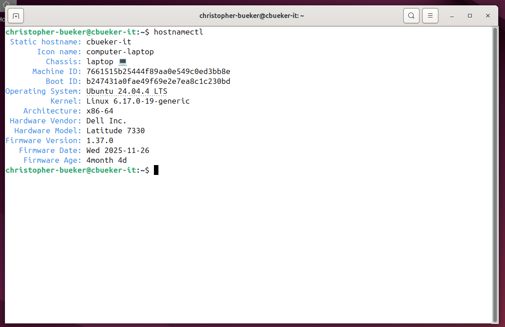
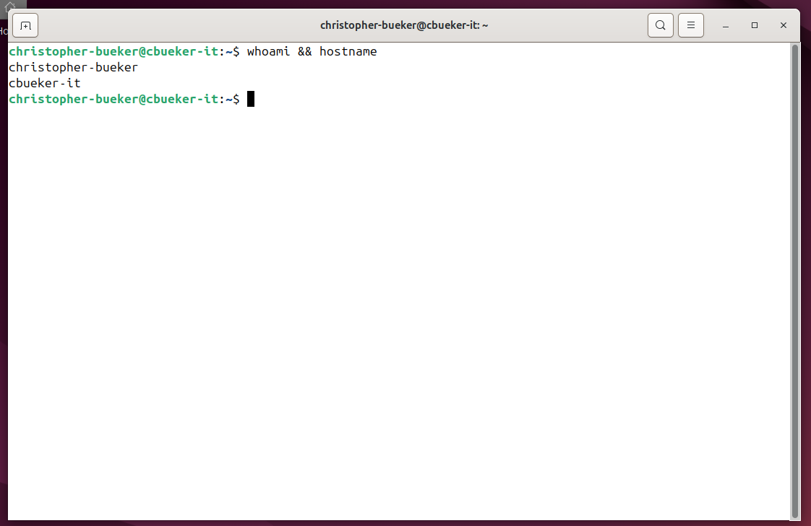
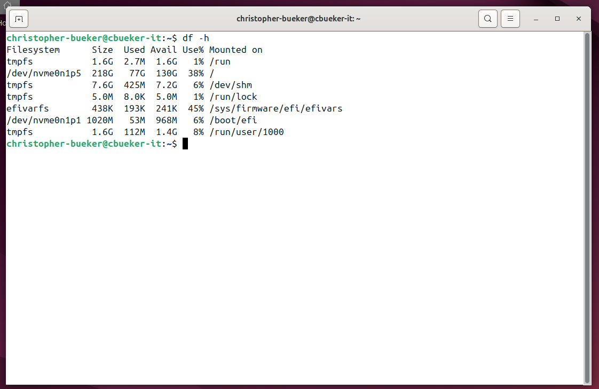
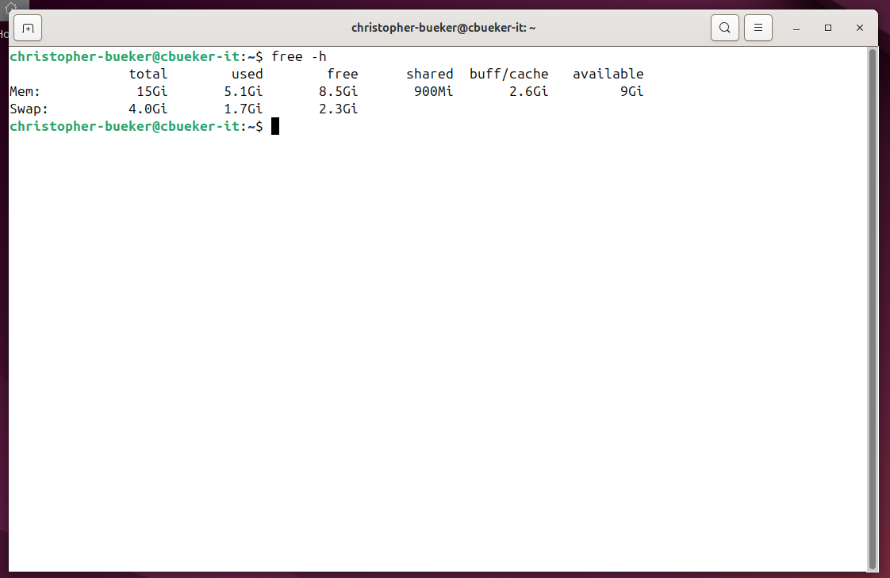
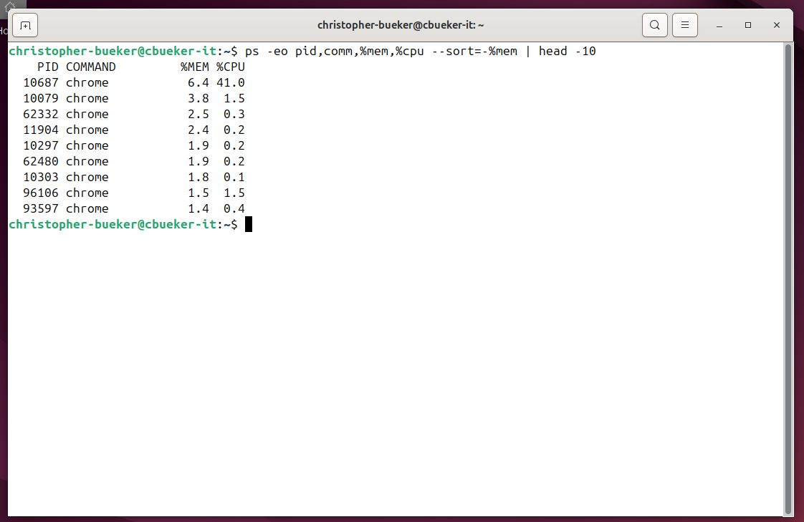
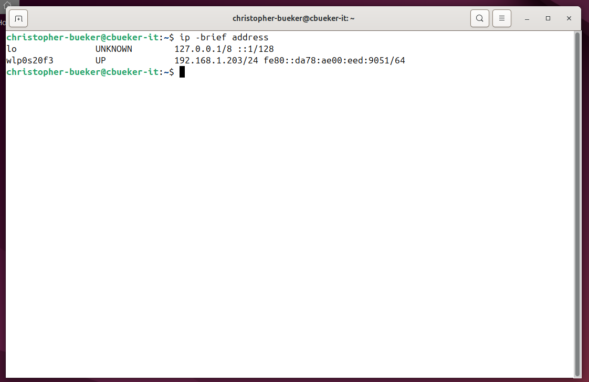
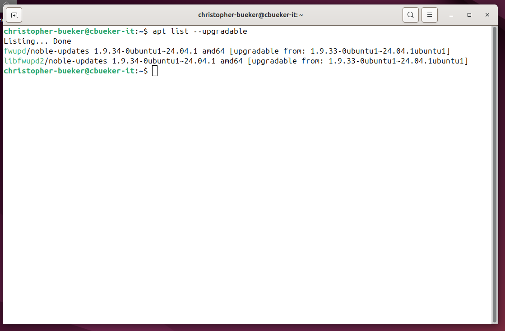
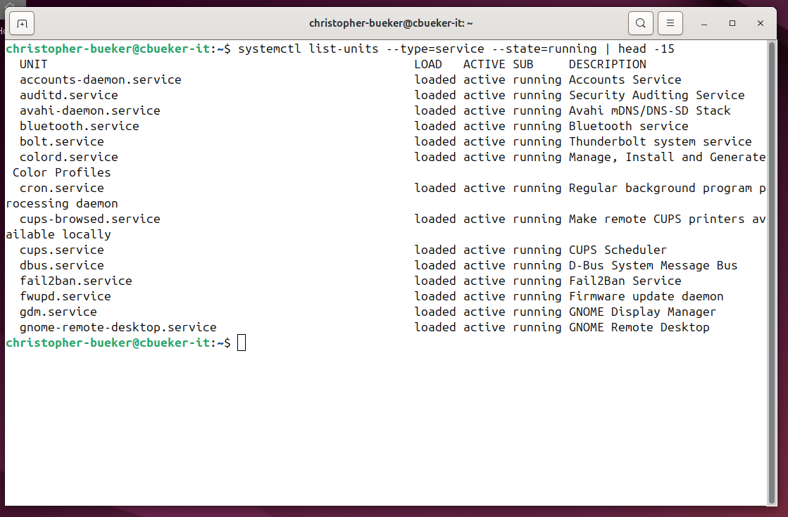

**Linux System Administration Lab**

I built this hands-on Ubuntu Linux administration lab on my personal system to practice core command-line administrative checks. This shows operating system review, identity verification, storage monitoring, memory monitoring, process inspection, network visibility, package maintenance, and running service review.

Lab Objectives

- Review Linux operating system details
- Verify active user and hostname
- Inspect disk usage and mounted filesystems
- Review memory and swap utilization
- Examine active processes
- Verify network interface addressing
- Check available package updates
- Review active running services

Operating System Review

I used `hostnamectl` to review operating system details, kernel version, hardware information, and architecture. This shows how Linux administrators verify platform identity before performing maintenance or troubleshooting tasks.

User and Host Verification

I used `whoami && hostname` to verify the active user account and local hostname. This shows how identity confirmation supports administrative awareness during command-line work.

Disk Usage Review

I used `df -h` to review mounted filesystems and storage consumption across active partitions. This shows how administrators monitor available disk space and filesystem usage.

Memory Review

I used `free -h` to review memory and swap utilization. This shows how available system resources are checked before troubleshooting performance or workload behavior.

Process Review

I used `ps -eo pid,comm,%mem,%cpu --sort=-%mem | head -10` to review active processes using the most memory. This shows how Linux administrators identify resource-heavy workloads during system review.

Network Review

I used `ip -brief address` to review interface status and assigned IP addressing. This shows how administrators verify local network connectivity and interface visibility.

Package Maintenance Review

I used `apt list --upgradable` to review available package updates. This shows how package visibility supports maintenance planning and update awareness even when phased updates are present.

Running Services Review

I used `systemctl list-units --type=service --state=running | head -15` to review active services currently running on the system. This shows how service visibility supports operational awareness in Linux administration.

Skills Practiced

- Linux command-line administration
- Operating system review
- Storage monitoring
- Memory monitoring
- Process inspection
- Network interface review
- Package maintenance review
- Service visibility

Summary

This lab demonstrates practical Linux administration through command-line system review. It shows how core administrative checks connect across operating system visibility, resource monitoring, maintenance awareness, and service management.

Related Troubleshooting Repositories

For deeper Linux troubleshooting examples, see these focused repositories covering firmware recovery and power management investigation:

[`efi-firmware-recovery`](https://github.com/cbueker-it/efi-firmware-recovery): EFI boot recovery and firmware troubleshooting after Linux startup failure.

[`ubuntu-suspend-debugging`](https://github.com/cbueker-it/ubuntu-suspend-debugging): Suspend and wake troubleshooting involving Linux power behavior and system diagnostics.

Navigation

[Back to GitHub Profile](https://github.com/cbueker-it)
